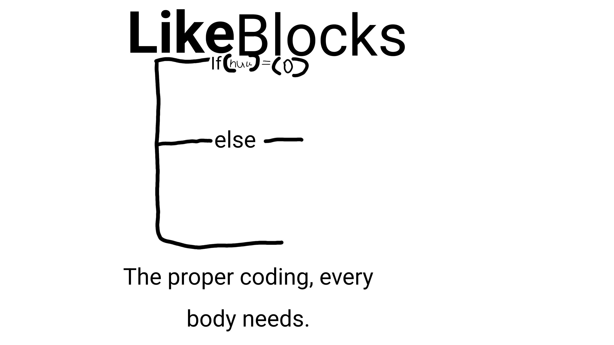

# LikeBlocks

**Scratch but better! + a direct convert to Javascript.**

LikeBlocks is a visual block-based programming environment that brings the simplicity of Scratch to a more powerful platform. Build intuitive programs using drag-and-drop blocks, then seamlessly export your creations as clean, executable JavaScript code.

## Features

- 🎨 **Visual Block Programming** - Intuitive drag-and-drop interface with colorful, organized blocks
- 🚀 **Direct JavaScript Export** - Instantly convert your block logic to production-ready JavaScript
- 💡 **Beginner-Friendly** - Perfect for learning programming fundamentals without syntax barriers
- 🔧 **Interactive Development** - Real-time feedback as you build and test your programs
- 📦 **Modular Blocks** - Organized categories of blocks for different programming concepts

## Getting Started

1. download the latest .html file
2. create a prototype using the blocks or upload a stick build file (.stkb)
3. convert a project to JavaScript
4. and deploy!

now your all done!

## How It Works

1. **Create** - Drag blocks onto the canvas to build your program
2. **Compose** - Connect blocks to create logic flows
3. **Convert** - Export your block program as JavaScript code
4. **Deploy** - Use the generated code in your projects

## Usage Examples

[Add code examples and screenshots here]

## License

This project is licensed under the MIT License - see the [LICENSE](LICENSE) file for details.

---

**Made with ❤️ for aspiring developers everywhere.**
